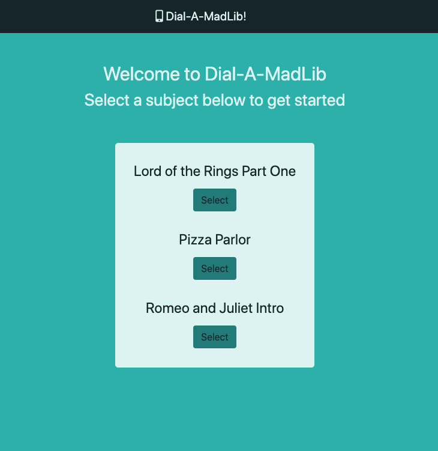
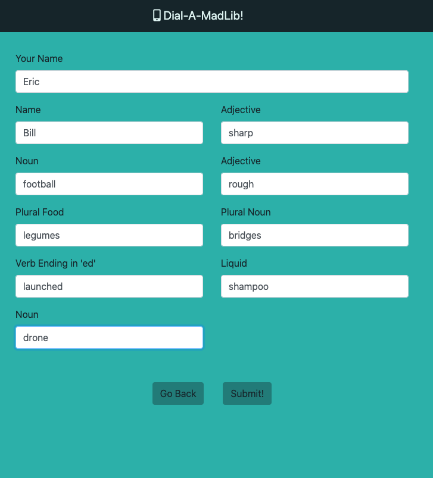
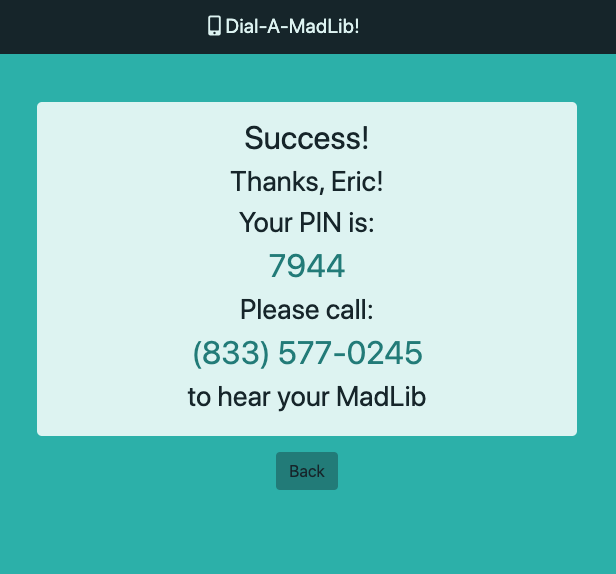

# AWS MadLib Application React Front-End

The AWS MadLib React Front-End is a mobile-first user interface allowing users to select and fill out a MadLib. Users are then provided with a phone number and PIN to retrieve their MadLib.

This application interfaces with an AWS API Gateway, endpoints, DynamoDB tables, and Amazon Connect to create a full stack application. The back end can be found in a convenient Serverless Framework deployment at [https://github.com/EricL0wry/aws-serverless-madlib-app.git](https://github.com/EricL0wry/aws-serverless-madlib-app.git)

## Live Demo

Try the application live at [https://madlibs.ericmichaellowry.com](https://madlibs.ericmichaellowry.com).

## Technologies Used

- JavaScript
- React
- Bootstrap 4
- Node.js
- Express
- Node Fetch
- Webpack
- dotenv
- JSX
- Babel
- CSS3
- HTML 5

## Features

- Users can get a list of available MadLibs
- Users can retrieve and fill out a MadLib template
- Users can submit their MadLib
- Users can listen to their compiled MadLib via telephone via a provided phone number and PIN

## Preview







## Development

### System Requirements

- NPM 6 or higher
- Node.js 10 or higher

### API Requirements

To run this application locally, you will need access to a back-end database and endpoints. You can find an easy to deploy AWS solution using the Serverless Framework at [https://github.com/EricL0wry/aws-serverless-madlib-app.git](https://github.com/EricL0wry/aws-serverless-madlib-app.git).

Running this backend will require both AWS and Serverless Framework accounts and the Serverless CLI installed on your local machine. Please see the readme file for more details.

### Getting Started

If you would like to use this application locally, please follow the steps below.

1. Clone the repository and navigate to the new local directory.

```shell
git clone https://github.com/EricL0wry/madlib-app-react-front-end.git
cd madlib-app-react-front-end
```

2. Install all dependencies with **NPM**.

```shell
npm install
```

3. Create a new **.env** file in the root directory of the project. There is .env.template file available for your convenience.

4. Populate your **.env** file with your system's information. Unless the ports are occupied, I've included some recommended ports:

```shell
PORT=3000
DEV_SERVER_PORT=3001
PHONE_NUMBER=(From your own Amazon Connect)
API_GATEWAY_URL=(From your own AWS API Gateway)
```

5. Start your **Node** server and **Webpack Dev Server** to get your dev environment working

```shell
npm run dev
```

6. In your browser, navigate to [http://localhost:3000](http://localhost:3000), or substitue your port number if it's different.

NOTE: You will need a working backend for this application to load any data.

## Amazon Connect Notes

Amazon Connect is AWS' business contact center solution and it's included in AWS' free tier. Configuring an Connect contact flow to work with this application is outside of the scope of this readme, however, there is plenty of [official documentation](https://docs.aws.amazon.com/connect/) that can help you through the process.
